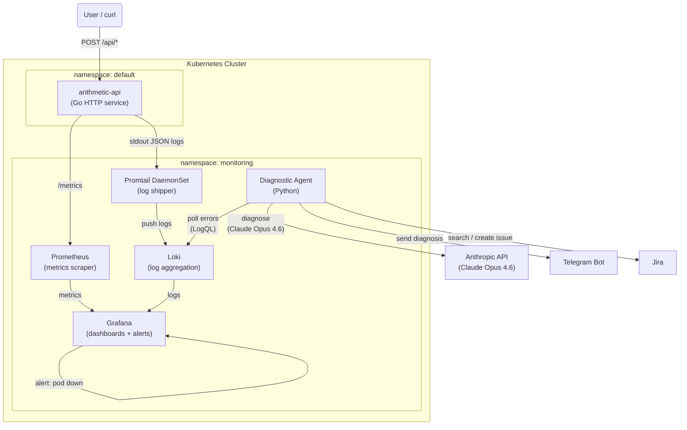

# Go Arithmetic API

A containerized microservice that provides basic arithmetic operations via a REST API, with a full observability stack running on Kubernetes.

## Overview

This project demonstrates a cloud-native Go application with production-grade observability: metrics collected by Prometheus, logs shipped to Loki by Promtail, dashboards and alerts in Grafana, and an AI-powered diagnostic agent that detects failures and sends diagnoses via Telegram.



### Features

- RESTful API for arithmetic operations (add, subtract, multiply, divide)
- JSON request/response format with input validation
- Health check endpoint for Kubernetes liveness/readiness probes
- Prometheus metrics: request counter and latency histogram
- Structured JSON logging compatible with Loki
- Promtail DaemonSet ships pod logs to Loki automatically
- Grafana dashboards pre-configured (no manual setup)
- Grafana alert fires when the pod restarts
- AI diagnostic agent: polls Loki for errors, diagnoses with Claude Opus 4.6 (adaptive thinking), notifies via Telegram and creates Jira issues automatically

---

## API Endpoints

All arithmetic endpoints accept `POST` requests with a JSON body.

### Request Format

```json
{ "a": 10, "b": 5 }
```

### Response Format

**Success:**
```json
{ "result": 15 }
```

**Error:**
```json
{ "error": "error message" }
```

### Endpoints

| Method | Path | Description |
|--------|------|-------------|
| `POST` | `/api/add` | Sum of `a` and `b` |
| `POST` | `/api/subtract` | Difference `a - b` |
| `POST` | `/api/multiply` | Product of `a` and `b` |
| `POST` | `/api/divide` | Quotient `a / b` (division by zero crashes the pod — intentional bug) |
| `GET` | `/health` | Health status: `{"status":"healthy"}` |
| `GET` | `/metrics` | Prometheus metrics |

**Examples:**

```bash
curl -X POST http://localhost:8080/api/add \
  -H "Content-Type: application/json" \
  -d '{"a": 10, "b": 5}'
# → {"result":15}

curl -X POST http://localhost:8080/api/divide \
  -H "Content-Type: application/json" \
  -d '{"a": 10, "b": 0}'
# → pod crashes and restarts (triggers Grafana alert)
```

---

## Kubernetes Deployment

### Prerequisites

- Kubernetes cluster (minikube, kind, or cloud provider)
- `kubectl` configured

### Deploy the application

```bash
# Build and load the image (minikube)
docker build -t go-arithmetic-api:latest .
minikube image load go-arithmetic-api:latest

# Deploy
kubectl apply -f k8s/deployment.yaml
kubectl apply -f k8s/service.yaml

# Access (minikube)
minikube service arithmetic-api
```

### Deploy the observability stack

```bash
kubectl apply -f k8s/monitoring/
```

This deploys (all in the `monitoring` namespace):

| Component | Role |
|-----------|------|
| **Prometheus** | Scrapes `/metrics` from the arithmetic API every 15s |
| **Loki** | Log aggregation backend |
| **Promtail** | DaemonSet — tails `/var/log/pods/**/*.log` and pushes to Loki |
| **Grafana** | Dashboards + alert rules, pre-configured via ConfigMaps |
| **Diagnostic Agent** | Polls Loki for errors, diagnoses with Claude, notifies Telegram |

### Access the stack

```bash
# Grafana — http://localhost:3000  (admin / admin)
kubectl port-forward svc/grafana 3000:3000 -n monitoring

# Prometheus — http://localhost:9090
kubectl port-forward svc/prometheus 9090:9090 -n monitoring
```

The **Arithmetic API** dashboard loads automatically with:
- Request rate per endpoint
- Error rate (5xx)
- P50 / P95 latency
- Live application log panel

### Diagnostic Agent setup

The agent requires a Kubernetes Secret before deployment:

```bash
# Fill in your values in k8s/monitoring/agent-secret.yaml, then:
kubectl apply -f k8s/monitoring/agent-secret.yaml
```

Required secrets:

| Key | How to obtain |
|-----|---------------|
| `TELEGRAM_TOKEN` | Create a bot via [@BotFather](https://t.me/BotFather) |
| `TELEGRAM_CHAT_ID` | Send a message to your bot, then call `GET https://api.telegram.org/bot<TOKEN>/getUpdates` |
| `ANTHROPIC_API_KEY` | [console.anthropic.com/settings/keys](https://console.anthropic.com/settings/keys) |
| `JIRA_URL` | Your Jira base URL, e.g. `https://yourorg.atlassian.net` |
| `JIRA_EMAIL` | Your Atlassian account email |
| `JIRA_API_TOKEN` | [id.atlassian.com/manage-profile/security/api-tokens](https://id.atlassian.com/manage-profile/security/api-tokens) |
| `JIRA_PROJECT_KEY` | Project key where issues will be created (e.g. `OPS`) |

The Jira keys are optional — if omitted, the agent still works (Telegram only).

The agent polls Loki every 30 seconds. When ERROR logs are detected:
1. Claude Opus 4.6 diagnoses the failure (adaptive thinking)
2. The agent extracts a short title from the error log (e.g. `division by zero`) and searches Jira for any open Incident with that title — if one exists, it links it in the alert; otherwise it creates a new Incident
3. The diagnosis + Jira link is sent to your Telegram chat

A 2-minute cooldown prevents duplicate alerts for the same incident.

---

## Metrics

Key Prometheus metrics exposed at `/metrics`:

| Metric | Type | Labels |
|--------|------|--------|
| `http_requests_total` | Counter | `method`, `path`, `status_code` |
| `http_request_duration_seconds` | Histogram | `method`, `path` |

---

## Docker

```bash
# Build
docker build -t go-arithmetic-api:latest .

# Run
docker run -p 8080:8080 go-arithmetic-api:latest
```

The Dockerfile uses a multi-stage build: `golang:1.26` to compile, `alpine:latest` for the runtime (~10 MB final image).

**Environment variables:**

| Variable | Default | Description |
|----------|---------|-------------|
| `PORT` | `8080` | HTTP listen port |

---

## Local Development

```bash
# Run
go run main.go

# Test
go test ./...
```

---

## Project Structure

```
.
├── main.go                         # Entry point, routing, graceful shutdown
├── Dockerfile                      # Multi-stage Docker build
├── go.mod / go.sum
├── handlers/
│   ├── arithmetic.go               # Add, Subtract, Multiply, Divide handlers
│   └── health.go                   # Health check handler
├── middleware/
│   ├── metrics.go                  # Prometheus metrics middleware
│   ├── logging.go                  # Structured JSON logging middleware
│   └── recorder.go                 # Response status recorder (shared)
├── models/
│   ├── request.go                  # OperationRequest struct
│   └── response.go                 # SuccessResponse / ErrorResponse
├── operations/
│   └── arithmetic.go               # Business logic
├── agent/                          # AI diagnostic agent (Python)
│   ├── main.py                     # Polling loop
│   ├── agent.py                    # Claude + Telegram + Jira orchestration
│   ├── loki.py                     # Loki HTTP client
│   ├── telegram.py                 # Telegram Bot API client
│   ├── jira.py                     # Jira REST API client
│   ├── requirements.txt
│   └── Dockerfile
└── k8s/
    ├── deployment.yaml             # App Deployment
    ├── service.yaml                # App Service
    └── monitoring/                 # Observability stack (namespace: monitoring)
        ├── namespace.yaml
        ├── prometheus-rbac.yaml    # ClusterRole for Kubernetes SD
        ├── prometheus-config.yaml  # Scrape config
        ├── prometheus-deployment.yaml
        ├── prometheus-service.yaml
        ├── loki-config.yaml
        ├── loki-deployment.yaml
        ├── loki-service.yaml
        ├── promtail-rbac.yaml      # ClusterRole for pod log access
        ├── promtail-config.yaml    # Pipeline stages (docker log format)
        ├── promtail-daemonset.yaml
        ├── grafana-datasources.yaml       # Prometheus + Loki datasources
        ├── grafana-dashboards-config.yaml # Pre-built dashboard
        ├── grafana-alerts.yaml            # Alert: pod down / restarting
        ├── grafana-deployment.yaml
        ├── grafana-service.yaml
        ├── agent-deployment.yaml
        └── agent-secret.yaml       # Gitignored — fill in manually
```

---

## Notes

- Loki and Prometheus use `emptyDir` storage — data is lost on pod restart. Add PersistentVolumeClaims for persistence.
- `agent-secret.yaml` is gitignored. Never commit credentials.
- The divide-by-zero endpoint is an intentional bug to demonstrate pod restart detection and alerting.

## License

MIT
